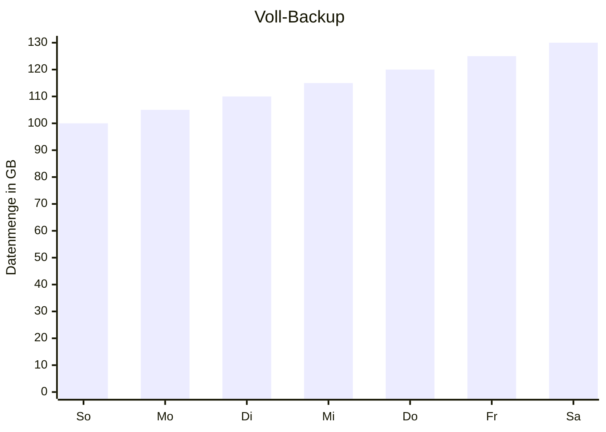
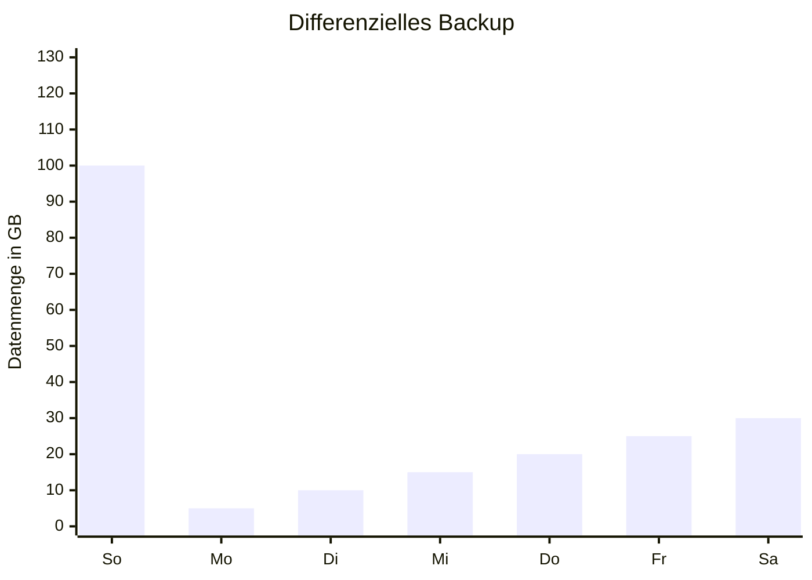
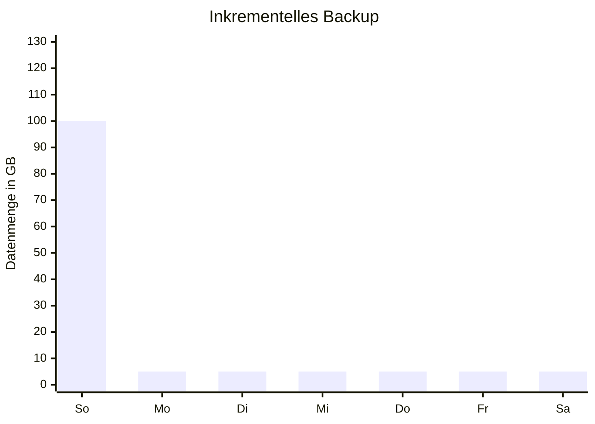

+++
tags = ['LF3', 'Speicher']
date = '2024-12-03'
draft = true
title = 'Backup'
+++
Backups sind Kopien eines ganzen Datensatzes mit dem Ziel die Daten wieder herzustellen, sollten diese nicht verfügbar sein.

Dabei muss man unterscheiden: **[RAID-Systeme]({}) sind kein Backup**, da diese das Ziel haben die Verfügbarkeit zu gewährleisten und nur in bestimmten Situationen durch RAID Daten gerettet werden.

Es gibt unter Anderem folgende Bedrohung für Daten:

- Hardwaredefekt (Festplatte, RAID Controller)
- Versehentliches löschen von Daten
- Naturkatastrophen wie Brand oder Flut im Serverraum
- Trojaner und Hacker

Für die Auswahl des Backups spielen folgende Faktoren eine Rolle:

- Sicherheit: Welche Szenarien werden abgedeckt?
- Verfügbarkeit: Wie schnell kann das Backup eingespielt werden?
- Kosten

## On-Premise und Off-Premise Backups

**On-Premise** Backups befinden sich auf dem selben Gelände und haben den Vorteil schneller verfügbar zu sein. Vor Naturkatastrophen, Trjanern und Hackern sind die Daten dort aber nicht sicher.

**Off-Premise** Backups liegen in einer Zweigstelle, auf Bändern in sicheren und externen Orten, oder in der Cloud. Diese bieten zusätzlich Schutz vor Naturkatastrophen, da sie räumlich getrennt liegen.

## Air-Gap und Immutable Backups

Um Schutz vor Verschlüsselungs-Trojanern zu erreichen gibt es zwei Methoden: Air-Gap und Immutable Backups.

**Air-Gap** bedeutet, dass das Backup nicht mit dem Netzwerk verbunden ist. Dies kann durch ein Backup auf Band erfolgen oder in kleinen Betrieben bereits durch ein Backup auf einer (oder mehr) externen Festplatten, welche zum Feierabend mitgenommen wird. Zum Zeitpunkt der Verschlüsselung sind diese nicht mit dem Firmennetzwerk verbunden und die Daten darauf bleiben unverschlüsselt.

**Immutable** bedeutet die Daten werden auf ein Medium geschrieben, welches danach nicht mehr verändert werden kann. Dieses Prinzip nennt sich Write-Once-Read-Many (WORM). Typischerweise sind die Medien aus Kostengründen so konfiguriert, dass sie nach Ablauf einer gewissen Zeit wieder beschreibbar gemacht werden. Korrekt umgesetzt hat niemand die Möglichkeit die Daten vor Ablauf der Zeit zu ändern.

## Zusammenspiel mit dem Datenschutz

Der Datenschutz sollte aus eigenem Interesse eingehalten werden. Ein Datenschutzverstoß würde auch bedeuten, dass diese Daten aus den Backups und Archiven gelöscht werden müssen. Wenn dies nicht möglich ist müssten die Backups neu erstellt werden und die Backups mit Datenschutzverstoß unbrauchbar gemacht werden müssten.

## Sicherungsarten

Beispiel:

Es werden täglich Backups gemacht und Sonntags Voll-Backups. Am Sonntag liegt das Datenvolumen bei 100 GB jeden Tag kommen 5 GB neue Daten hinzu.

**Voll-Backup**: Speichert alle Daten.

Mit **einem** Backup können alle Daten wieder hergestellt werden.

**Differenzielles Backup**: Speichert alle neuen Daten seit dem letzten Voll-Backup.

Das Voll-Backup und das Differenzielle Backup zusammen Ergeben das neuste Backup und werden **beide** zur Wiederherstellung benötigt.

**Inkrementelles Backup**: Speichert alle Daten seit dem letzten Backup.

Alle Backups bis zum letzten Voll-Backup müssen vorhanden sein. Wenn auf ein Voll-Backup sechs inkrementelle Backups folgen werden **alle Backups bis inkl. des letzten Voll-Backups benötigt**.

**Nachteile**: Je mehr Backups benötigt werden je **länger dauert das zurückspielen** und desto **größer ist die Chance, dass eines der Medien defekt ist** und somit dieses Backup nicht genutzt werden kann. Im Beispiel wäre mit einem defekten Mittwoch inkrementellen Backup nur der Zustand bis zum Dienstag wiederherstellbar. Mittwoch und die darauffolgenden Backups nicht nutzbar.

**Vorteile**: Die Backups sind **schneller geschrieben** und **benötigen weitaus weniger Speicherplatz und somit Kosten**.

## Generationenprinzip

Im Generationenprinzip, auch Großvater-Vater-Sohn-Prinzip genannt, werden die Backups im Rotationsschema aufgezeichnet um kosteneffizient aktuelle, sowie weit zurück reichende Backups parat zu haben. Mit 20 Medien, z.B. Magnetbänder oder Festplatten(verbunde) können tägliche Backups der letzten 4 Tage, wöchentliche Backups der letzten 4 Wochen und monatliche Backups der letzten 12 Monate zurückgespielt werden.

*Anmerkung: In der Praxis wären Backups älter als 1 Monat kaum brauchbar. Eine Produktion kann die Daten aus mehreren Monaten unmöglich händisch wiederherstellen. Derart alte Daten fallen eher unter die Kategorie Archiv.*

## 3-2-1(-1) Regel

**3** Kopien der Daten sollten existieren. Das wären die Originaldaten und zusätzlich 2 Backups. Die Wahrscheinlichkeit, dass drei Backups zur gleichen Zeit ausfallen ist ziemlich gering. Hingegen kann es passieren, dass eine zweite Kopie während des Lesevorgangs, welcher mehrere Stunden dauern kann, kaputt geht.

**2** verschiedene Medien sollten benutzt werden. Dadurch soll vermieden werden, dass alle Kopien durch den selben Einfluss gleichzeitig kaputt gehen. Z.B. sind Festplatten empfindlich gegen Bewegung und ein Erdbeben könnte alle Kopien gleichzeitig betreffen. Oder Kopien auf Bänder existieren, aber es gibt kein Bandlaufwerk, welches ältere Bänder lesen kann aufgrund fehlender Abwärtskompatibilität.

**1** Backup sollte extern sein. Dies schützt vor Naturkatastrophen und Einbrüchen.

**(1)** Backup sollte mit Air-Gap oder als immutable Backup erstellt werden. Dies schützt vor Verschlüsselung.

Beispielhafte Umsetzung:

3-2-1 simpel: Original auf der Laptop SSD, eine Kopie auf dem Handy, eine weitere Kopie in der Cloud. – *Kein ausreichender Schutz vor Verschlüsselungstrojaner.*

3-2-1-1 gewerblich: Original im File-Server, eine Kopie auf dem Backup-Server, eine weitere Kopie auf Band, welches ein Mitarbeiter mitnimmt. ODER die externe Kopie findet immutable in der Cloud statt. – *selbst wenn alle Kopien auf SSDs und damit auf dem selben Medium gespeichert sind gibt es kein Scenario, bei dem ein Ausfall aller Kopien auch nur gering wahrscheinlich ist.*

## Speichermedien

**USB-Sticks und (Micro-)SD Karten**: Werden aus günstigsten Flash-Chips hergestellt und sollten nicht als Kopie gezählt werden.

**SSD und eMMC**: Hochwertige Flash-Chips mit exzellenter Geschwindigkeit. Haben folgende Schwächen:

- Begrenzte Schreibzyklen (Abhängig vom Controller und ob QLC, TLC, MLC oder SLC im Einsatz ist. SLC ist selbst für Datenbanken lange geeignet).
- Datenverlust bei langen Zeitraum ohne Strom
- Teuer per GB

**HDD**: Magnetspeicher mit beweglichen Teilen. Gute sequenzielle Schreib- und Leserate. Schwächen:

- Bewegliche Teile sind vor allem im Betrieb empfindlich gegen Stöße. Erdbeben und Externe HDDs in Taschen oder auf Schreibtischen verursachen Stöße.
- Mechanische Belastung. Ältere HDDs können kaputt gehen, während das Backup über mehrere Stunden die HDD voll auslastet.

**Magnetband**: Magnetbänder liefern bei sehr großen Datenmengen das kostengünstigste Medium per GB. Kassetten können Roboter gesteuert gewechselt werden. Die sequenzielle Schreib und -Leserate kann höher als die von HDDs sein (je nach Generation kann dies anders herum sein). Nachteile:

- Hohe einmalige Kosten
- Begrenzte Abwärtskompatibilität
- Bewegliche Teile (jedoch Robuster als HDDs)
- Speicher lässt sich praktisch nur für Backups oder Archive verwenden – nicht für aktive Daten

---

**Cloud**: Kein Medium. Die technische Umsetzung liegt in der Verantwortung des Betreibers. Die Backups sind schnell verfügbar. Immutable lässt sich umsetzen – Air-Gap jedoch nicht.

- Technische Umsetzung in Verantwortung des Betreibers
- Internetbandbreite begrenzt Geschwindigkeit
- Hohe laufende Kosten

