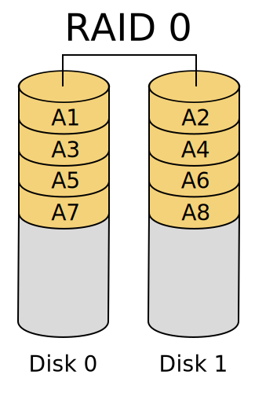
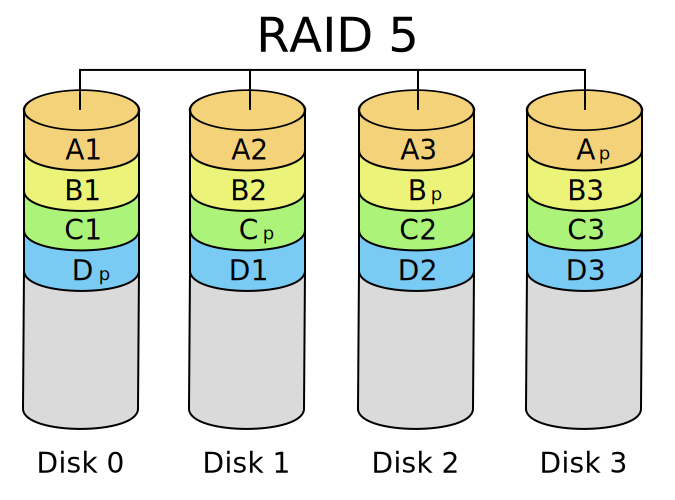

+++
date = '2024-12-03T15:50:48+01:00'
draft = true
title = 'RAID – Redundant Array of Independent Discs'
tags = ['LF3', 'Speicher', 'Mathe']
+++
RAID-Systeme können für Ausfallsicherheit = Verfügbarkeit und schnelleren Datenzugriff sorgen. Erreicht wird dies durch einen RAID-Controller und dem Zusammenschluss mehrerer Festplatten (mit Festplatten sind in diesem Artikel immer HDDs, wie auch SSDs gemeint).

Wenn bei RAID-Systemen Festplatten unterschiedlicher Größe verbaut werden kann nur der Speicher des kleinsten gemeinsamen Nenners benutzt werden.

Bei drei 4 TB Festplatten + einer 6 TB Festplatte wird nur 4 × 4 = 16 TB genutzt und 2 TB bleiben ungenutzt.

## JBOD – Just a Bunch of Disks (kein RAID)

Mehrere Festplatten werden zu einem Volume zusammengefügt. Es kommt zu keinem schnellerem Zugriff und keiner Verbesserung der Verfügbarkeit.

- Keine Datenredundanz
- Beim Ausfall einer Festplatte sind diese Daten unbrauchbar
- Nettokapazität = 100 %
- Kein RAID: Beliebige Festplattengrößen können kombiniert werden

## RAID 0

- Keine Datenredundanz
- Striping-Verfahren
- Beim Ausfall **einer** Festplatte sind **alle** Daten unbrauchbar
- Parallele Schreib- und Lesezugriffe → Hohe Transferrate
- Nettokapazität = 100 %
- beliebig viele Festplatten mit beliebigen Kapazitäten können verbunden werden

Quelle: https://commons.wikimedia.org/wiki/File:RAID_0.svg

## RAID 1

- Volle Redundanz
- Daten werden gespiegelt gespeichert
- Parallele Lesezugriffe → hohe Lesegeschwindigkeit
- Nettokapazität = 50 % (bei 2 Festplatten, nur Kapazizät einer Platte)
- Beliebig viele Festplatten können verbunden werden

Quelle: https://commons.wikimedia.org/wiki/File:RAID_1.svg

## RAID 5

- Striping-Verfahren + Parität
- eine beliebige Festplatte Redundanz
- Verbund von drei oder mehr Festplatten
- Netto Kapazität = Alle Festplatten minus einer. Mindestens ⅔

Quelle: https://commons.wikimedia.org/wiki/File:RAID_5.svg

### Parität Berechnung per XOR-Logik:

|       |||||
|-------|---|-|-|-|
| **HDD 1** | 1 |0|0|1|
| **HDD 2** | 0 |1|1|1|
| **HDD 3** | 1 |0|1|1|
| **HDD 4 Rechnung** | 1 + 0 + 1 = Dezimal 2 = Binär 1**0** |0 + 1 + 0 = Dezimal 1 = Binär 0**1**|0 + 1 + 1 = Dezimal 2 = Binär 1**0**|1 + 1 + 1 = Dezimal 3 = Binär 1**1**|
| **HDD 4 Ergebnis** | **0** |**1**|**0**|**1**|

## RAID 6

- Striping-Verfahren + Parität
- zwei beliebige Festplatte Redundanz
- Verbund von vier oder mehr Festplatten
- Netto Kapazität = Alle Festplatten minus zwei. Mindestens 50%

Quelle: https://commons.wikimedia.org/wiki/File:RAID_6.svg

## RAID 10

- Festplatten werden erst im RAID 1 verbunden – dieser Verbund dann im RAID 0
- Eine **beliebige** Festplatte darf ausfallen
- Vereint die Vorteile von beiden Verfahren
- Benötigt mindestens vier Festplatten – kann mehr Platten gerader Anzahl verbinden

Quelle: https://commons.wikimedia.org/wiki/File:RAID_10.svg

## RAID-Z

Software RAID ohne Controller im ZFS-Dateisystem.

Z-Level wählbar, welches die Parität angibt. Bedeutet bei RAID-Z1 darf eine beliebige Festplatte ausfallen, vergleichbar mit RAID-6. Bei RAID-Z2 dürfen zwei beliebige Festplatten ausfallen, vergleichbar mit RAID-6, bei RAID-Z3 dürfen drei beliebige Festplatten ausfallen, etc.

- Beliebige Anzahl Parität
- Kein RAID Controller nötig, wodurch auch keiner ausfallen kann
- Den Festplatten wird nicht „vertraut“. RAID-Controller setzen auf die Self-Monitoring, Analysis and Reporting Technology (SMART) der Festplatten.

## Links

https://fachinformatikerpruefungsvorbereitung.de/abschlusspr%C3%BCfungteil1/systemintegration/raid/
